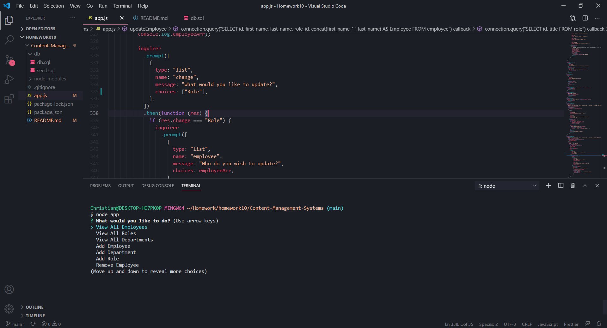

# Content-Management-Systems
  
## My story
* This homework enabled me to better understand how you can communicate with Databases
* Taught me to safely code to prevent SQL injection attacks
* How to manipulate tables and columns to pull and update information how you see fit!
## Features ##
* Add, Update, or Remove employees all from the command line!
* A user is allowed to delete a manger even if he has an employee under his manager id. (will set employee's manager id to null)
* Base code is in place to allow me to update this app in the future to allow for more updating!
## Installation ##
1. Open up git bash terminal
2. Change directory to desired location (%User Profile%/SourceRepo)
3. Clone the repository (git clone git@github.com:ChristianGoldman/Content-Management-Systems.git)
## Usage ##
1. Open up git bash terminal
2. Change directory to the cloned repo
3. Navigate to the Content-Management-Systems folder
4. In the command line run "npm install"
5. In the commmand line run "node app.js"
6. Select a inquirer prompt to do what you want!
7. You should see a command line application similar to this

## Credits ##
* Cwerness gitlab
* http://expressjs.com/en/5x/api.html
* https://www.w3schools.com/js/default.asp
* https://www.mysqltutorial.org/
* https://www.npmjs.com/package/mysql
* Tutor Makism
* BCS learning assistants
* TA's Paul Hendrickson, Tommy Boone, Jake O'Thoole, Daniel Thao
## Link to Youtube walkthrouh ##
* [Youtube video!](https://www.youtube.com/watch?v=zWCyLzVXEUo)
## License ##
    MIT License

    Copyright (c) [2020] [Christian Goldman]

    Permission is hereby granted, free of charge, to any person obtaining a copy
    of this software and associated documentation files (the "Software"), to deal
    in the Software without restriction, including without limitation the rights
    to use, copy, modify, merge, publish, distribute, sublicense, and/or sell
    copies of the Software, and to permit persons to whom the Software is
    furnished to do so, subject to the following conditions:

    The above copyright notice and this permission notice shall be included in all
    copies or substantial portions of the Software.

    THE SOFTWARE IS PROVIDED "AS IS", WITHOUT WARRANTY OF ANY KIND, EXPRESS OR
    IMPLIED, INCLUDING BUT NOT LIMITED TO THE WARRANTIES OF MERCHANTABILITY,
    FITNESS FOR A PARTICULAR PURPOSE AND NONINFRINGEMENT. IN NO EVENT SHALL THE
    AUTHORS OR COPYRIGHT HOLDERS BE LIABLE FOR ANY CLAIM, DAMAGES OR OTHER
    LIABILITY, WHETHER IN AN ACTION OF CONTRACT, TORT OR OTHERWISE, ARISING FROM,
    OUT OF OR IN CONNECTION WITH THE SOFTWARE OR THE USE OR OTHER DEALINGS IN THE
    SOFTWARE.